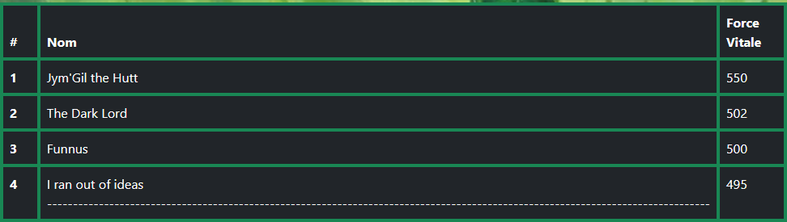
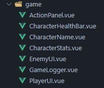

# Doc du TP02 du code de Jimmy Ouellet

Par Anthony R.

## Récit 1

### Bootstrap

Le visuel avec Bootstrap a été très bien fait et nous a donné une base solide pour tout le reste du visuel de notre site.

### Style & CSS

Le titre de la page utilise une modification du h1 qui est réutilisée dans chaque page du site. Il serait intéressant, pour éviter la répétition du code, de mettre la modification du h1 accessible à tous (par exemple dans le style.css).

L'image de fond du site est bien, mais il serait intéressant de l'implémenter d'une façon qui permettrait à chaque page d'avoir sa propre image/couleur de fond pour nous offrir davantage de flexibilité.

## Récit 2

### Bootstrap

La table bootstrap parvient à garder la bonne taille peu importe la taille des éléments à l'intérieur, ce qui est une très bonne chose. Cependant, il va falloir limiter la taille que le nom des joueurs peut avoir puisque s'il est trop long cela peut causer des problèmes tels que dans cet exemple:

*Pas si problématique, mais il est préférable d'éviter tout de même.

Il y avait également la `
` inutile laissée derrière qu'il vaut mieux retirer pour faciliter la lecture du code.

## Récit 6

### Composantes

La `PlayerUI` est divisée en plusieurs composantes pour éviter la répétition du code et l'alléger. Il serait par contre préférable de créer un dossier pour les composantes reliées aux statistiques, car cela prend beaucoup de place dans le dossier de composantes et réduit ainsi sa lisibilité.

## Récit 7

### Principe du Don't Repeat Yourself

Le code de `EnemyUI` est très similaire au code de `PlayerUI`. Le code est bien optimisé afin d'éviter trop de répétition, mais il y en a quand même beaucoup. Par exemple, la classe de la div container est la même : `class="bg-dark border border-success rounded border-4 characterUI container-fluid"`. Il aurait pu être possible de créer une seule composante `CharacterUI` qui serait réutilisée pour les deux affichages de stats. Cependant, cela aurait été beaucoup de props à passer en paramètre et donc assez complexe à mettre en place.

### Cacher les serviteurs

Dans les stats des ennemis, il ne fallait pas afficher leur nombre de serviteurs puisqu'ils n'en ont aucun. Pour ce faire, la div contenant les serviteurs est cachée, mais conserve sa présence, ce qui conserve un affichage similaire aux stats du joueur. Cela est très bien fait à l'exception que dans le v-bind qui ajoute la classe `hidden`, il vérifie que le minionCount est undefined. Il vaudrait peut-être mieux envoyer une valeur fictive comme (-1) plutôt que de ne pas passer de valeur.
